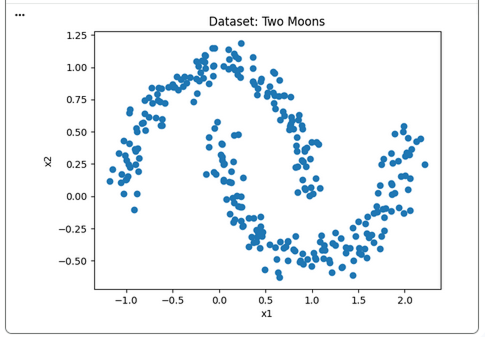
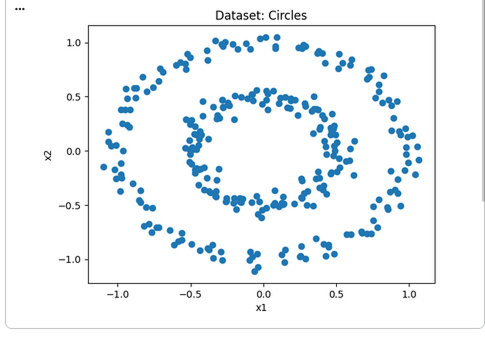
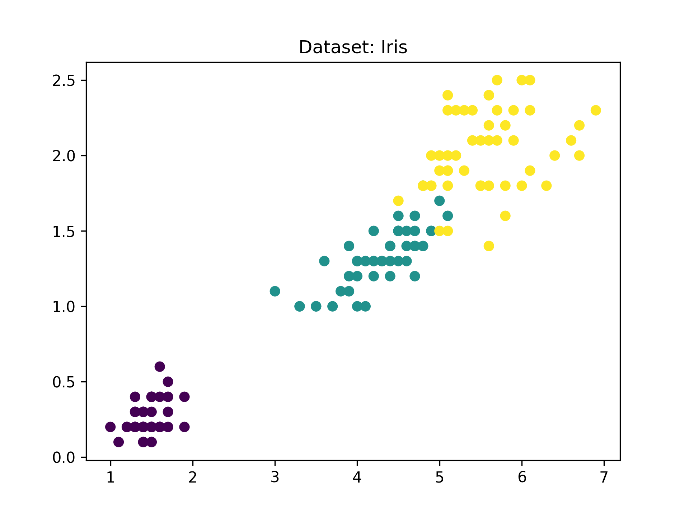

# Spatial Clustering Problem with DBSCAN Algorithm

> Implementation of the clustering algorithm for the classification problem.

## Introduction

In order to explore the DBSCAN solution for unsupervised clustering, three
native [**scikit-learn**](https://scikit-learn.org) datasets will be used:
_two-moons_ (randomly generated), _two-circles_ (randomly generated) and
_iris_ (classic dataset).

    

> _two-moons_ instance plot.

    

> _two-circles_ instance plot.

    

> _iris_ instance plot.
